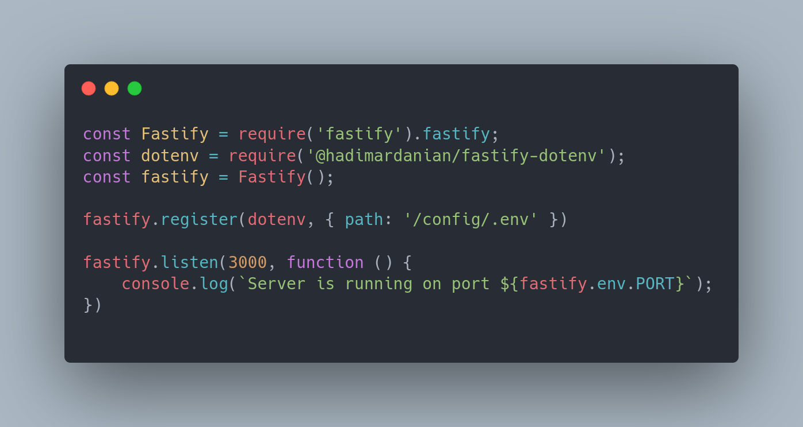

# fastify-dotenv

fastify-dotenv iterate over your .env file and converts it to a **decorator** named *env*


## simple demo



  
## Usage/Examples

```javascript

const Fastify = require('fastify').fastify; // i used v3.21.6 here
const fastify = Fastify();
const dotenv = require('@hadimardanian/fastify-dotenv');

fastify.register(dotenv, {
    path: '/config/.env', // (1)
    decorator: 'env' // (2)
})

fastify.listen(4000, function serverListen() {
    console.log('server is running on port ' + fastify.env)
})

```


  
## some tips

- (1) **path** : the "**/**" means the root of project folder. it must be at the beginning of path
- (2) **decorator** : name it whatever you want, if omitted it will be "**env**"
- the "**.env**" file: Its name could be everything. but its format must be plain text and content must be like following:


  
### .env file content

> port=4000

> mngodb=mongodb://localhost/mydb

> NODE_ENV=production

  
